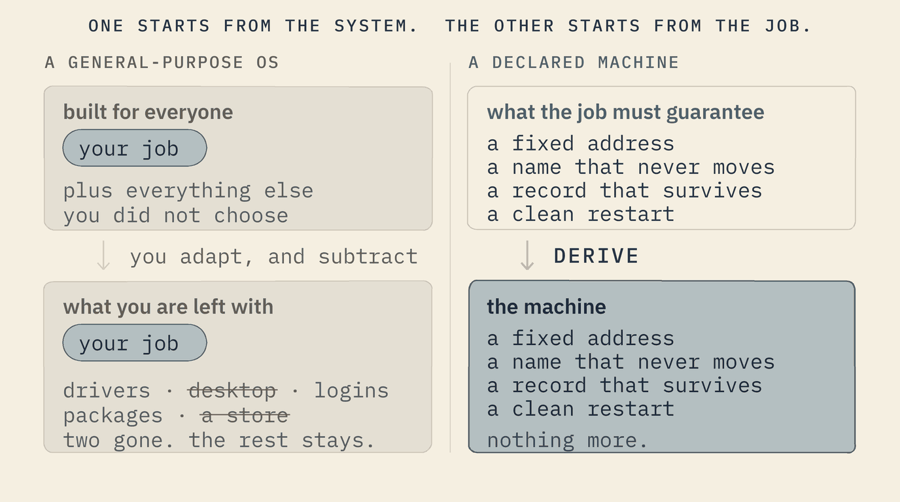
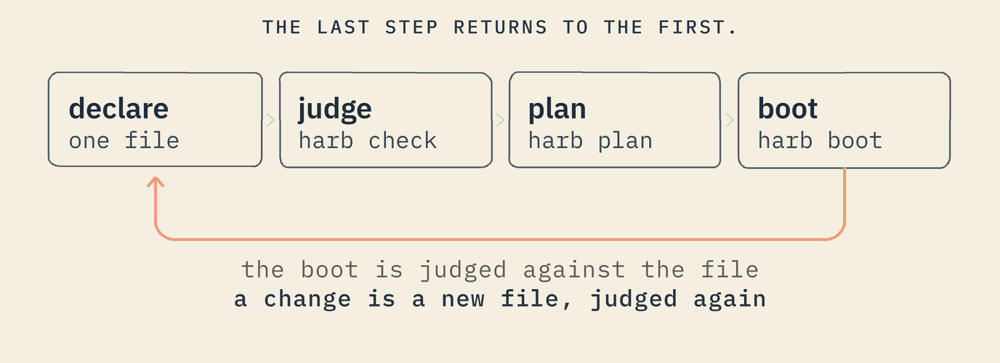
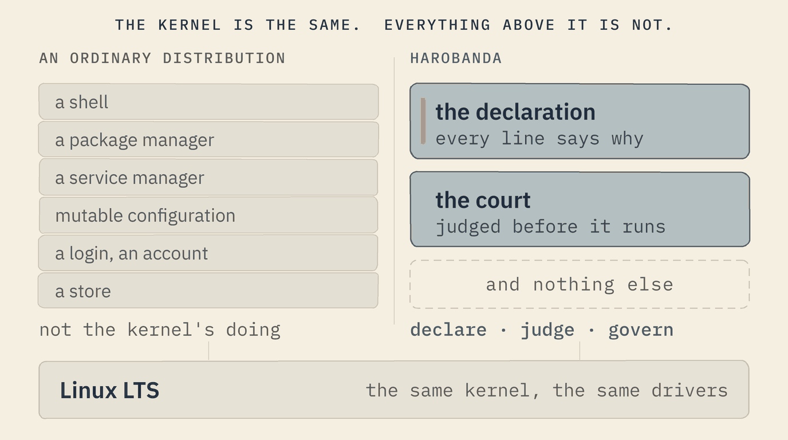
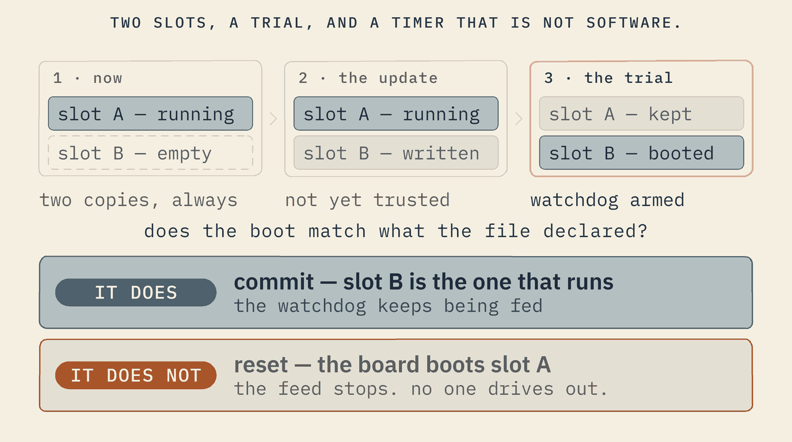

<p align="center">
  
</p>

<p align="center">
  <b>The declared machine.</b><br>
  You describe the whole computer in one text file. It boots exactly that, and checks every boot against the file.
</p>

---

**Built for AI agents you must be able to govern.** An agent on a declared
machine is one program the file names, and the file says what it may touch:
the network or not, which disks, how much memory. The kernel, the core of the
operating system, holds it to exactly that, and there is no shell, no
installer and no login on the box for it to use instead.
[How that works →](#built-for-governed-ai-agents)

New to the words this project uses? Each one is explained by what it does in
[The words, in plain terms](#the-words-in-plain-terms).

The illustrated long version, with every diagram, is the site:
**[mayouni.github.io/harobanda](https://mayouni.github.io/harobanda/)**.

## Why it exists

Every operating system you can buy is shaped by its vendor: the account you
sign in with, the store you cannot remove, the telemetry you cannot see, the
update you cannot refuse, the support that ends on a date someone else picks.
Even a free system is shaped by whoever curates it — its package repositories,
its defaults, its release calendar.

Harobanda began with real solutions for shops, clinics, banks and public
services in West Africa, where the power cuts out, the network comes and goes,
and a cloud you cannot reach is a liability rather than a help. What those
solutions needed was simple to say: **a box that survives the power cut, a
name that never moves, records that never leave the room.** Those guarantees
turned out to live one floor below the application — in the operating system.

So Harobanda turns the relationship around: **the operating system is shaped
by your solution, not by a vendor.**

<p align="center">
  
</p>

## The idea

You write down what the machine must be, in one text file:

- which computer it is: the board (a PC, a Raspberry Pi) and the kind of
  processor;
- which disks it uses, and in which folder the files of each one appear;
- which programs it keeps running;
- what each of those programs is allowed to touch: the network, the disks,
  how much memory and processor time.

Every part must say **why** it is there: a part with no reason is refused.

Harobanda works out everything else from that file: the order things start
in, which parts of the kernel (the core of the operating system) are switched
on, and the image, the exact files the machine boots from. The machine then
boots as that description, printing a line for every step as it takes it, and
at the end **checks what it did against what you wrote**, line by line. If the
two differ, it says where.

There is no shell (no command line to type into), no package manager, no
login and no app store on the machine. Nothing is installed afterwards: to
change the machine, you change the file, and the new file is checked again.

### A whole machine, in nine lines

```
DEFINE MACHINE hello AS (
  PROFILE hosted,
  ARCH x86_64,
  KERNEL linux
) RATIONALE "the smallest machine that boots"

DEFINE SERVICE greet AS (
  RUN ["/app/greet"]
) RATIONALE "say hello, then exit"
```

`RATIONALE` is not a comment. `harb check`, which this project calls *the
court* because it gives a verdict, refuses any part of a machine that does not
say why it is there. It accepts this one, and the repository checks that on
every build.

## Built for governed AI agents

An AI agent that can act (read files, call services, change things) needs
limits it cannot talk its way out of. On most systems those limits live in the
agent's instructions, or in a policy that some software above the operating
system is trusted to enforce. On a declared machine they live in the machine
file, and the kernel enforces them: the agent is a program like any other, and
it has what its declaration grants and nothing else.

This is a whole box for an assistant that answers from an office's own
documents. The court accepts it:

```
DEFINE MACHINE hub AS (
  PROFILE hosted,
  ARCH x86_64,
  KERNEL linux
) RATIONALE "an office's own assistant, on one box"

DEFINE CAPABILITY filesystem AS (
  GRANT yes
) RATIONALE "the assistant reads the office's documents"

DEFINE CAPABILITY inference AS (
  GRANT yes
) RATIONALE "the model runs here, on this box"

DEFINE MOUNT docs AS (
  AT "/docs",
  FS ext4,
  DEVICE "/dev/vda"
) RATIONALE "the disk that holds the documents"

DEFINE SERVICE assistant AS (
  RUN ["/app/assistant"],
  RESTART always,
  NEEDS [filesystem, inference],
  MEMORY 2048,
  CPU 200
) RATIONALE "answers from the documents; no network at all"
```

What that file means for the assistant, and what enforces each part:

| the file says | what happens | who enforces it |
|---|---|---|
| no `NETWORK` block | the box brings up no network, so there is nothing to send the documents through | nothing exists to use: no network interface is ever set up |
| `NEEDS [filesystem, inference]`, and not `process` | it may read the disk the file attaches, and it may not start any other program | the kernel refuses the request to start a program |
| `MEMORY 2048` | at most 2 GiB of memory; past that, the kernel stops it, and nothing else on the box notices | the kernel's control groups |
| `CPU 200` | at most two processor cores' worth of time; past that, it waits its turn | the kernel's control groups |
| nothing: this holds for every program | no program may attach disks, set the clock, load code into the kernel, look inside another program or restart the box | a kernel filter, set before the program starts |
| nothing: there is no shell and no installer | there is no command line to open and nothing to install | the image: they were never put in |

Every boot prints these limits before the assistant starts. If the kernel
could not set one of them up, the assistant is not started, and the boot is
judged different from its file.

**If the agent wants more, it has to ask in writing.** The machine is a file
in a small, strict language, which an agent can write as well as a person
can. A change it drafts is checked by `harb check` before anything runs, a
person approves it, and the box tries it once: if the boot does not match the
new file, the box goes back to the old one.

**Why the operating system, and not only a sandbox?** Because the kernel is
the one layer a program cannot argue with. Instructions can be talked around,
and a policy enforced by software above the operating system is only as strong
as that software. A sandbox can fence one program on a general-purpose
machine; a declared machine has nothing else on it, so the file that sets the
agent's limits is also the whole description of the box, and a reviewer reads
both at once.

**What is real today, for agents.** The limits in the table are built, and
each is proven by a reference machine whose boot shows the kernel holding a
program to it. Not built yet: a firewall (a machine that declares a network has
routes only to what it declares, and knows no way anywhere else, but nothing
yet blocks a program that looks for one); a record of what an agent did (the
machine signs a record of every boot, not of each action inside it); and the
tools for an agent to draft a change and a person to approve it. Harobanda
does not include a model: `inference` is a permission the file grants, and
the program brings its own model.

## How it works

<p align="center">
  
</p>

| step | what happens |
|---|---|
| **declare** | you write a `.machine` file |
| **judge** | `harb check` reads the file against the language's rules: every line must be one the language knows, every program must be granted what it asks for, every part must say why it is there. It accepts the file, or refuses it with the line and the reason, such as *alerts needs network, which no declaration grants* |
| **plan** | `harb plan` prints the order things will happen in at boot, before any of it does |
| **boot** | QEMU, a program that imitates a whole computer, boots the machine, and the machine prints a line for every step. At the end it compares, line by line, what it printed with what the file says a correct boot prints, and lists any difference |
| **break it** | change one line and watch the check catch the difference |

To *judge*, in this project, always means that: compare with what must be,
and say plainly where it differs.

A guarantee you have only ever watched succeed is a claim. One you have
watched refuse you is evidence — which is why every lesson in the guided tour
ends by showing you how to break it.

## The words, in plain terms

Every word this project uses, explained by what it does. They are the same
words, in the same order, that `harb learn --words` prints and that the site's
word page shows, and `harb docs --check` fails if any of them drift apart.

| word | what it means in practice |
|---|---|
| **a machine** | One computer, written down in a `.machine` file: which board and processor it has, which disks it uses, which programs it runs, and what each program may touch. It is only text until it is built. |
| **a declaration** | One block of that file, starting with `DEFINE`: the machine itself, a program, a disk, a network, a permission. Every block must end with a `RATIONALE`, which says in plain words why it is there, and a file with one missing is refused. |
| **a clause** | One line inside a block, such as `RUN [...]` (the program to start) or `NEEDS [...]` (what it must be allowed to do). Each kind of block accepts a fixed list of clauses, and any other is refused by name. |
| **a service** | A program the machine starts and looks after, declared with `DEFINE SERVICE`. It says what to run, whether to restart it when it stops, and what it needs. |
| **a capability** | One kind of access a program must be granted before it has it: `network`, `filesystem` (the disks), `process` (starting other programs), and a few more. A program that did not ask for `network` runs with no network at all, because the kernel gives it none. |
| **to mount** | To attach a disk, or one part of a disk, so that its files appear in a folder: an SD card's second partition at `/data`, for instance. A `MOUNT` block names the disk and the folder. It can also be scratch space held in memory, which vanishes when the machine stops. |
| **the kernel** | The core of the operating system: the part that drives the hardware and decides what each program is allowed to do. Harobanda uses the Linux kernel, unmodified; the machine file decides which of its parts are switched on. What is new is everything above it. |
| **to judge** | To check something against what it must be, and say plainly where it differs. Before anything runs, `harb check` judges a machine file against the language's rules. At the end of every boot, the machine judges what it printed against what its file says a correct boot prints. |
| **the court** | The part of `harb` that judges a machine file before anything runs (`harb check`). It gives a verdict, which is why it is called a court: accepted, or refused with the line number and the reason in plain words. It is checked in turn against example files it must accept and more it must refuse (`zig build court`). |
| **the plan** | The order in which the machine will do things when it boots: which disks first, which programs after which. `harb plan` works it out from the file and prints it before anything runs. |
| **an image** | The exact files a machine boots from: the kernel, `harb`, the programs, the machine file itself, and a copy of what a correct boot must print. A change to the machine is a new image, built from the changed file. |
| **QEMU** | A free program that imitates a whole computer, so a machine can boot on your laptop with no board at all. |
| **PID 1** | The first program the kernel starts when a computer boots. It starts every other program and looks after them until the machine stops. Every Linux system has one (on Ubuntu it is systemd); on a declared machine it is `harb` itself, reading the machine file. PID means process ID, the number the kernel gives each running program. |
| **the transcript** | Everything one boot printed, from the first line to the last. The machine prints a line for every step as it takes it, which this project calls narrating. |
| **a pin** | A saved copy of a transcript someone read and found right, kept in the repository as `machines/<name>.expected`. The next boot is compared with it line by line, so any change shows up as a difference. |
| **a world** | One service while it runs, inside walls the kernel keeps: what it did not ask for (the network, a disk, starting other programs) it does not have. The word is this project's; the walls are Linux's own (namespaces and control groups). |
| **the envelope** | The walls around one world: exactly what it may see and do, and how much memory and processor time it may use. They are worked out from what the world declared it `NEEDS`, never from a separate permission file someone could edit later. |
| **the floor** | What no world may do, whatever it declared: attach or detach disks, set the clock, load code into the kernel, rename the machine, build or enter walls of its own, look inside or take control of another program, or restart the box. |
| **EGRESS** | The list of networks a machine may reach beyond its own. The kernel is given a route (the directions to a network) to those and to no others, and every boot says so. A route is not a wall: the machine knows no way anywhere else, which is not the same as being blocked from finding one. |
| **a trial** | How an update is installed: it is written to a second copy of the system and booted once. If that boot matches its file, the update is committed, which means kept. If it does not, the board goes back to the copy it had. |
| **the watchdog** | A timer in the hardware that restarts the board unless the system keeps resetting it. The machine stops resetting it when a trial boot does not match its file, or when a service that promised to keep answering goes quiet: a bad update undoes itself, and a stuck box restarts. |
| **a fleet** | A set of machines checked together, in a `.fleet` file. Some mistakes only show across a set: two boxes that each claim to be the network's server are each fine alone. |
| **a seat** | One unit of work in this project's history, tagged like `NS-1` or `SEE-1`. Every rule in the doctrine names the seat that paid for it, and `experiment/PROTOCOL.md` tells each story in full. |

## Not a new kernel

<p align="center">
  
</p>

Underneath runs the same Linux LTS kernel as Ubuntu and Red Hat (LTS: long-term
support, a version maintained for years) — the same drivers, the same hardware
support, the same years of hardening. What was
rethought is everything the industry treats as inevitable above it. For an IT
team that is the reassuring part: no exotic kernel to certify; what is new is
the discipline above it.

## What it changes, in practice

| on an ordinary OS | on a declared machine |
|---|---|
| the box's address can move after a power cut | its network address and its name are written in the file, and the box itself tells the other devices where to find it |
| a bad update can leave it unable to boot | an update is tried once and kept only if its boot matches the file; otherwise the board goes back to the version it had |
| a shell and packages to patch and guard | no shell and no packages: most of what you usually secure is not there |
| "the data stays here" is a policy on paper | one declared line leaves the box no route out, and every boot says so |
| an AI agent is limited by its instructions | an agent has what its declaration grants, and the kernel holds it there |
| you hope it behaves as intended | it checks its own boot against its file, every time |
| records are whatever the software kept | the box signs a record of every boot with a key only it holds, and anyone with its public key can check that no record was altered |

An update, concretely — two copies of the system, and a trial:

<p align="center">
  
</p>

The emulator proves the trial and the rollback today. On a real board the
last word belongs to the watchdog, a timer in the hardware that restarts the
board unless the system keeps resetting it; the Raspberry Pi's is the next
step (see [What is real today](#what-is-real-today)).

**Who it is for.** Whoever answers for a whole solution, not only its code.
The programmer, whose machine is its own configuration and its own
documentation. The administrator, who has no shell to secure and no packages
to patch. The auditor, who can read the whole machine in one file and check a
signed record of every boot. And whoever puts an AI agent to work, and has to
answer for what it can reach.

**None of this came from a lab.** It came from real work, in Niamey and in
France:

- **Sonibank**, a bank in Niamey, demands provable changes, for the new
  version of our Organizium software.
- **ESPA-MT**, a higher-education school in Niamey, teaches its students to
  design and govern their own AI. Our work is the foundation of its AI &
  Computational Thinking course.
- **DIKO**, a national NGO in Niamey, keeps its sensitive data in-house: the
  host server for its Diko AI agent.
- **Cousbox**, a restaurant in Lyon, France, needed a box server for
  RestoLean, our platform for neighbourhood commerce: customers order from
  their phone, with no account, and the order reaches the kitchen. On its
  first trial, on 15 August 2026, a fridge tripped the breaker and the router
  rebooted: the server's address changed, and two hours of observations were
  lost.

Not one of them runs on Harobanda yet. They are where it comes from.

## Try it

You need [Zig](https://ziglang.org) 0.15. No account, no sign-up.

Build the one binary:

```sh
zig build -j2
```

Let the court rule on a machine, then read its plan. This one
declares a single network destination, and not the open internet:

```sh
zig-out/bin/harb check machines/qemu_egress.machine
zig-out/bin/harb plan machines/qemu_egress.machine
```

Take the guided tour — eighteen lessons, each ending with a way to break it:

```sh
zig-out/bin/harb learn
```

### Boot it

Booting needs Linux (on Windows, WSL's Ubuntu), QEMU, and the tools that
build a Linux kernel. On Ubuntu:

```sh
sudo apt install qemu-system-x86 gcc make flex bison bc \
  libelf-dev libssl-dev cpio xz-utils curl
```

Then, from the repository root:

```sh
zig build cross -j2
bash experiment/os2_kernel_fetch.sh
bash experiment/os2_image.sh qemu_egress
```

The first line builds `harb` for the machine itself. The second fetches
the kernel source this repository pins, and refuses it unless its digest
matches. The third builds a kernel and an image, boots it in QEMU, and
judges the boot; the first run takes a few minutes. The machine says,
as it boots, what the kernel will and will not let it reach:

```
boot: egress lan -- 10.9.0.0/16 and nowhere else:
    no default route
reach 10.9.0.1 -- a route exists: this machine knows a way there
reach 8.8.8.8 -- no route: this machine knows no way there
boot: judge -- the boot matches its expectation
    (/etc/expected, 14 lines)
```

(An indented line continues the one above it.) The whole transcript, and
the verdict against the transcript this repository pins, land in
`zig-out/wsl/image_qemu_egress.txt`.

Then break something: add a clause the grammar does not accept, or ask for a
capability nothing grants, and read what the court says back.

The reference machines that run only `harb` need nothing outside this
repository. Four also run a Luau world under `stzr`, the runtime from the
stz repository, which is private today: `qemu_hello`, `qemu_budget`,
`makeen_box` and `makeen_qemu`. Without it they do not boot at all:
`harb image` refuses each one before any kernel is built, naming the first
service it cannot stage. The guided tour says so before the two lessons
that boot one of them, and every line those lessons quote is in the
machine's pinned transcript, `machines/<name>.expected`, for a reader
without the runtime to follow.

## What is real today

Honesty is part of the design, so these are the plain limits.

- **It is a working system, and a young one.** Declared machines boot and
  judge themselves in an emulator today. No customer yet runs a critical
  production workload on one.
- **The kernel underneath is borrowed on purpose** — the same Linux LTS the
  major distributions ship, pinned by digest (a fingerprint of the exact
  source, so any change to it would show) and built by your own compiler.
  Borrowed is not the same as withdrawable.
- **The card has not met a Pi yet.** The Raspberry Pi 4 image boots under
  QEMU's `raspi4b` and is judged against a pinned transcript; the real board
  is the next step.
- **Single-binary deployment is the goal, not yet the whole reality.**
  Declaring, judging and planning need only this binary. Booting in an
  emulator, and producing an image you can write to a card, still need QEMU
  and a standard kernel build underneath (see [Try it](#try-it)).
- **It will never be a product you buy from a vendor**, because a vendor
  inside the system is the one thing it refuses. That is not a gap to close.

## Three profiles, one language

A profile is the kind of device a machine file describes. The language is the
same for all three.

| profile | the device | what runs on it | state |
|---|---|---|---|
| **hosted** | a PC, a server, a Raspberry Pi | the Linux kernel, a few self-contained programs (no shared libraries to install), and `harb` itself as the first program the kernel starts (PID 1) | **boots** on x86_64 and ARM processors under QEMU, and as a Raspberry Pi 4 image; judged |
| **edge** | a microcontroller: a small chip with no operating system underneath | one program that is the whole device (MicroRing's side of the family) | declared and judged; turned into a MicroRing project; not yet booted |
| **touch** | a tablet | the tablet's own kernel, with the app as the only thing it starts | declared and judged; not built |

## Where things are

| what | where | judged by |
|---|---|---|
| the machine language: its kinds and their closed menus | `declarative/machine/GRAMMAR.md` | every case pinned, in `zig build court` |
| the parser and the court's checks | `src/machine.zig` | unit tests and fixtures |
| the boot plan, derived | `src/plan.zig` | fixtures |
| PID 1: `harb` as the first program the machine runs | `src/init.zig` | its own transcript, run for real |
| the image: the files the machine boots from, the kernel's options, the boot settings | `src/image.zig` | QEMU transcripts against `machines/*.expected` |
| the network: the wire is up before any service | `src/netcfg.zig`, `src/net.zig` | fixtures and a two-machine boot |
| identity: a device's key, and the record it signs | `src/journal.zig` | `machines/qemu_identity.expected` |
| a fleet: facts about a set, the keys a device used to have, and the ways between its links | `src/fleet.zig` | `declarative/fleet/`, `experiment/os7_fleet.sh`, `experiment/os8_links.sh` |
| a machine that is the way between two networks, and the names it answers across them | `src/machine.zig` (`FORWARD`), `src/names.zig`, `src/get.zig` | `machines/qemu_forward.expected`, `machines/cloud_links.expected` |
| a solution's services, written apart from a machine and placed on one; and the program that says a server is serving | `src/pack.zig`, `src/ready.zig` | `harb court --pack`, `machines/qemu_cloud_ringserv.expected` |
| updates: two slots, and a trial before any commit | `src/update.zig` | the card read back after a trial |
| the guided tour, judged like any other claim | `src/learn.zig` | `harb learn --check` |
| the pages: every code line fits GitHub's column, every machine a page shows in full is one the court accepts, and the words are the tour's own | `src/docs.zig` | `harb docs --check`, in `zig build court` |
| the reference machines | `machines/` | each boots and is judged against its pin |
| the illustrated long version | `site/`, published at [mayouni.github.io/harobanda](https://mayouni.github.io/harobanda/) by `.github/workflows/pages.yml` on every push that changes it | the court judges every machine it shows in full |
| the vendored kernel, pinned by digest | `vendor/PIN.md` | kernel.org's own sums |

Design documents live in `doc/`: `VISION.md` for what this is for,
`ARCHITECTURE.md` for how it is put together, `GROUND.md` for the solutions it
is the floor of, `DIVIDEND.md` for what owning the floor gives each layer
above it, `CLOUD.md` for how many machines compose into a cloud that serves
one solution (the first two of its six rungs are built, on emulated
machines; the rest are not), and `PROVENANCE.md` for the
rulings that shaped it.

## For contributors

Every change passes the same four gates:

```sh
zig build -j2
zig build test -j2
zig build court -j2
zig build cross -j2
```

`zig build cross` is not optional: `src/init.zig` only compiles for Linux, and
Zig analyses only the side of a compile-time branch it takes, so a Windows
build proves nothing about PID 1, the part of `harb` that runs as the
machine's first program.

The experiments that boot real machines, each judged against a pinned
transcript:

- `bash experiment/os2_image.sh <name>` — image, kernel, QEMU boot, judged
  against `machines/<name>.expected`;
- `bash experiment/judge_guarantees.sh` — the four standing promises;
- `bash experiment/os6_names.sh` — two machines on one wire: a box that serves
  names, and a till that asks;
- `bash experiment/os7_fleet.sh` — a device's key, a fleet that enrols it, a
  rebuilt card and a stolen one;
- `bash experiment/os8_links.sh` — three machines on two wires: a till on
  one link reaches a server on the other through a box that is the way
  between them (the server is RingServ, built from its own source by
  `experiment/ringserv_build.ps1`);
- `bash experiment/os9_cloud.sh` — a real server placed on a declared
  machine and booted, with the program that says it is serving.

Every line of doctrine here was paid for by a mistake, and each is written up
under its own tag in `experiment/PROTOCOL.md`, newest first. A few of them:

- **Fixtures are the judge.** Every refusal case carries the exact words its
  refusal must contain.
- **A pin is not a record of what happened; it is a claim that what happened
  was right.** Never copy a transcript over its expectation without reading
  the diff.
- **A promise the machine announces and cannot keep is worse than one it
  never made.** When the mechanism behind a declared guarantee fails, refuse
  the act and say so.
- **A tutorial is a claim about the system**, so it is judged like one — and
  so is every example on this page.

## A note on names

Three names, one thing, and they are not interchangeable:

| **Harobanda** | the system — what it is called, in every sentence |
|---|---|
| **`harb`** | the binary and the command — what you type |
| **`harobanda`** | the repository, and the directory you clone it into |

It is named for the bridge across the Niger River that joins the two banks of
Niamey, because the machine likewise joins a solution's promises to the
hardware that keeps them.

It was called `stzos` until 2026-09-20, which is the name the git history
carries. The ruling that changed it is STZ-OS-RULING-02 in
`doc/PROVENANCE.md`, beside the one it supersedes.

## Licence

MIT, © 2026 Mansour Ayouni — the licence the estate's other code already
carries (stzlib, Ring++, MicroRing, zin). [`LICENSE`](LICENSE) is the
licence itself, and [`LICENSING.md`](LICENSING.md) says what it covers and
what it does not: a machine is built from Linux, which is GPL-2.0 and is
fetched and pinned by digest rather than contained here, so an image that
carries the kernel carries the kernel's obligations.
